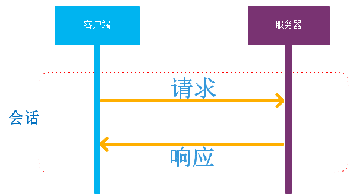

# SEHttpHelper

## 简介
一套简单的Android HTTP请求封装。支持功能：
1. HTTP/HTTPS请求
2. HTTP/HTTPS 同步或异步请求
3. 文件上传
4. SSH配置
5. 支持对象的直接转换。

## 使用介绍
### 开发思路
 一个普通的HTTP请求包括：
 1. 封装请求。
 2. 发起请求。
 3. 得到响应。
 4. 将整个从请求到响应的过程称为会话。
 5. 将请求返回的响应字符串或JSON等转换成对象。



 会话支持取消功能。

#### 封装请求
封装请求包括封装：
- 请求的Header
- 请求的参数
- 请求上传的文件
- 连接参数配置

示例：
```
  HttpRequest request = new HttpRequest("www.google.com",80);
  request.addRequestHeaderProperty("Content-Type","text/html;charset=UTF-8");
  request.addRequestParam("param1","123456");
  request.addRequestFileParam("file1",file);
  request.setRequestTimeout(10000);
  ...
```

#### 提交请求
使用HttpHelper工具类进行Get和Post请求提交。同步或者异步请求取决于调用者
的需求。提交方法如下：
```
 public <T> HttpSession<T> doHttpGet(HttpRequest request, HttpResultResolver<T> resolver, HttpCallback<T> callback)
 public <T> HttpSession<T> doHttpGet(HttpRequest request, HttpResultResolver<T> resolver, HttpCallback<T> callback)
 public <T> HttpSession<T> doHttpGet(HttpRequest request, HttpResultResolver<T> resolver, HttpCallback<T> callback)
 public <T> HttpSession<T> doHttpGet(HttpRequest request, HttpResultResolver<T> resolver, HttpCallback<T> callback)
```
调用者可以不关注返回的session，通过callback参数异步得到响应。也可以将callback传null，通过HttpSession#getResponse得到响应结果。
此外，HttHelper的几个重要配置方法：
- 线程池配置
  - 在 new HttpHelper是可以使用默认的构造器也可以使用带线程池参数的构造器来选择是线程池的使用策略。
- HTTPS配置
  - 使用HttpHelper#setHttpsSSLConfig(HttpsSSLConfig conf)来实现调用者自己的HTTPS策略。

例如：
```
  HttpRequest request = new HttpRequest("www.google.com",80);
  request.addRequestHeaderProperty("Content-Type","text/html;charset=UTF-8");
  request.addRequestParam("param1","123456");
  request.addRequestFileParam("file1",file);
  request.setRequestTimeout(10000);
  HttpHeler httpHelper = new HttpHelper();
  HttpSession session = httpHelper.doGet(request,null,null);
  HttpResponse response =session.getResponse
  ....
```

#### 响应错误码
HttpResponse包含两套错误码，系统错误码还业务错误码，#getCode和#setResultCode。
- 系统错误码：HTTP响应的错误码以及请求过程中出现的程序性错误码。
    - 例如：404页面未找到等系统级别的错误码。
    - 例如：HttpResponse#ERROR_CODE_TIME_OUT 请求超时等。
    - 例如：HttpResponse#ERROR_CODE_SERVER 出现了业务错误等。
- 业务错误码：具体业务返回的错误码，例如登陆失败用户的密码错误，因为HTTP请求是成功，但是服务器返回了业务错误码。
    - 当服务器的错误码为HttpResponse#ERROR_CODE_SERVER，此时业务错误码才有意义。
    - 例如：105 密码错误。
    - 例如：104 用户不存在。

#### 对象转换
在提交请求的时候传入正确的HttpResultResolver<T>响应内容解析器，就可以从HttpResponse#getResult获取的T所代表的实体类对象。
如果resolver为null，在getResult也是null.
这对于响应的数据结构是JSON/XML等业务数据的解析有很大用途，实现一个通用JSON2Object的解析器，就能够方便的实现业务数据的对象化转换。

#### 取消会话
在请求完成之前，可以通过HttpSession#cancelTask方法取消任务。

